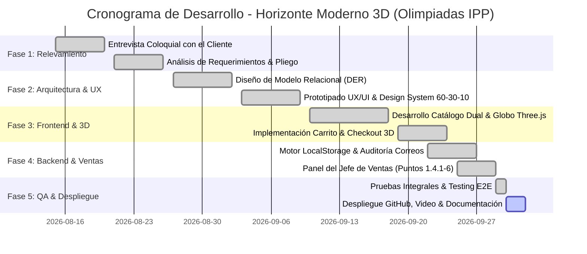
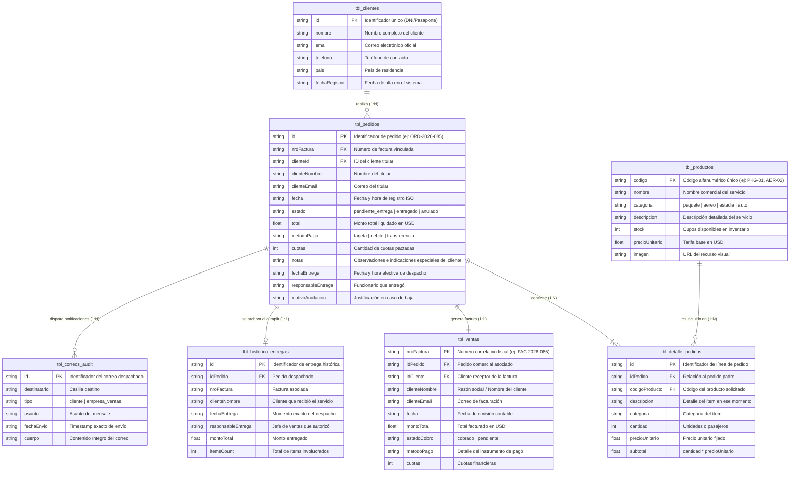

# 📘 Carpeta Técnica & Documentación de Proyecto: Horizonte Moderno 3D
## Olimpiadas de Informática / IPP – Instancia Escolar – 6to Año
**Institución:** E.I.C.O. N° 1 "Gral. Enrique Mosconi" – Caleta Olivia, Santa Cruz  
**Proyecto:** Plataforma Web Turística Comercial e Inmersiva "Horizonte Moderno"  
**Repositorio Oficial GitHub:** [https://github.com/agusalbz/web-olimpiadas.git](https://github.com/agusalbz/web-olimpiadas.git)  
**Versión del Sistema:** v2.4.0-Production (Release Olimpiadas IPP)

---

## 📑 Índice General del Proyecto
1. [Hoja de Distribución de Tareas por Rol (Equipo de 5 Integrantes)](#1-hoja-de-distribución-de-tareas-por-rol)
2. [Cronograma de Trabajo y Diagrama de Gantt (6 Semanas)](#2-cronograma-de-trabajo-y-diagrama-de-gantt)
3. [Transcripción de la Entrevista Coloquial de Relevamiento](#3-transcripción-de-la-entrevista-coloquial-de-relevamiento)
4. [Especificación Formal de Casos de Uso (CU-01 a CU-12)](#4-especificación-formal-de-casos-de-uso)
5. [Diagrama de Entidad-Relación (DER) y Arquitectura de Datos](#5-diagrama-de-entidad-relación-der)
6. [Ficha Técnica: Stack Tecnológico, Arquitectura & Paleta 60-30-10](#6-ficha-técnica-stack-tecnológico-y-diseño)
7. [Guía de Verificación y Credenciales para la Mesa Evaluadora](#7-guía-de-verificación-y-credenciales)
8. [Guion Técnico y Estructura del Video Expositivo](#8-guion-técnico-para-el-video-expositivo)
9. [Manual Operativo de Usuario: Jefe de Ventas (Sector Interno)](#9-manual-operativo-de-usuario-jefe-de-ventas)
10. [Reflexión Final del Equipo de Trabajo (1 Carilla)](#10-reflexión-final-del-equipo-de-trabajo)

---

## 1. Hoja de Distribución de Tareas por Rol

Para simular una estructura profesional de desarrollo de software conforme a los estándares de la industria y las bases de las Olimpiadas IPP, se definió un equipo multidisciplinario con responsabilidades asignadas:

| Rol Asignado | Responsable | Funciones & Entregables Principales |
| :--- | :--- | :--- |
| **Líder de Proyecto / Scrum Master** | *Integrante 1* | Gestión de cronograma, moderación de daily meetings, seguimiento del backlog en Trello/GitHub Projects, redacción de la reflexión final y coordinación del video expositivo. |
| **Analista Funcional & de Requerimientos** | *Integrante 2* | Conducción del relevamiento coloquial, diagramación de Casos de Uso (CU), matriz de trazabilidad, definición del modelo relacional (DER) y validación de reglas de negocio. |
| **Diseñador UX/UI & Motion Specialist** | *Integrante 3* | Creación del Design System (paleta 60-30-10, tipografías Fraunces + Inter), maquetación accesible (contrastes AA/AAA, prefers-reduced-motion), prototipado Glassmorphism y microinteracciones. |
| **Programador Frontend & 3D (Lead Developer)** | *Integrante 4 (Programador)* | Codificación de componentes React 19, Three.js (globo interactivo y clima tridimensional), motor de sonido Web Audio API, Carrito dinámico, Checkout 3D y vista dual de catálogo. |
| **Programador Backend, QA & Persistencia** | *Integrante 5* | Implementación de `DbStorageService` (simulación de motor relacional en LocalStorage), módulo de auditoría de correos automáticos, panel del Jefe de Ventas y pruebas unitarias/E2E. |

---

## 2. Cronograma de Trabajo y Diagrama de Gantt

El ciclo de desarrollo se planificó en **6 semanas**, abarcando desde el relevamiento inicial hasta la puesta en producción y entrega final:



### Hitos Principales (Milestones):
- **Hito 1 (Fin Semana 2):** Pliego de Requisitos formalizado y DER aprobado.
- **Hito 2 (Fin Semana 4):** Catálogo de productos interactivo con vista de lista sin imágenes (1.3.1) y carrito funcional.
- **Hito 3 (Fin Semana 5):** Pasarela de pagos con confirmación en estado "Pendiente de Entrega" (1.3.3) y disparo dual de correos auditados.
- **Hito 4 (Fin Semana 6):** Panel completo del Jefe de Ventas (1.4.1 a 1.4.6) y repositorio GitHub publicado.

---

## 3. Transcripción de la Entrevista Coloquial de Relevamiento

**Fecha:** 18 de Agosto de 2026  
**Lugar:** Sala de Reuniones E.I.C.O. N° 1 / Videoconferencia Teams  
**Entrevistadores:** Analista Funcional y Diseñador UX  
**Entrevistados:**
- **Lic. Roberto Albarracín** (Director General de Horizonte Moderno)
- **Carlos Méndez** (Jefe del Departamento de Ventas)

---

### Diálogo de la Entrevista:

> **Analista:** *Buenos días, Roberto y Carlos. Gracias por su tiempo. El objetivo de esta charla es entender de primera mano qué dolores tienen hoy en su agencia de viajes y qué esperan concretamente del nuevo sistema web comercial.*

> **Roberto (Director):** *Hola chicos, gracias a ustedes. Miren, nuestro principal dolor de cabeza hoy es que dependemos de llamados telefónicos y planillas sueltas. La competencia tiene páginas vistosas, pero nosotros queremos ir un paso más allá: queremos que el cliente sienta que ya está viajando desde que entra a la web. Por eso nos interesa que tenga tecnología 3D, que puedan girar el mundo, ver el clima de los destinos y escuchar los sonidos del lugar. Pero fundamentalmente, necesitamos que **puedan comprar de manera ágil y clara**, no solo consultar.*

> **Analista:** *Respecto al proceso comercial, en el pliego se menciona un "Carrito de compras" como comisión principal del problema. ¿Cómo visualizan esa experiencia?*

> **Carlos (Jefe de Ventas):** *Exactamente. Un cliente común no compra un único pasaje y se va. A veces quiere armar un combo: saca el vuelo a Cancún, después le agrega una estadía en un hotel all-inclusive, y por ahí también quiere alquilar un auto para moverse en la península. El carrito tiene que permitirle meter todo eso en una sola canasta, poder subir o bajar cantidades (por ejemplo si viaja una familia de 4 personas), ver subtotales claros sin letra chica, y vaciarlo o borrar ítems si se arrepiente.*

> **Diseñador UX:** *¿Y qué pasa con la visualización de los productos? Algunos usuarios nos comentan que cuando tienen conexiones lentas las fotos pesadas demoran.*

> **Carlos (Jefe de Ventas):** *¡Al clavo le diste! En el pliego lo pedimos expresamente en el punto 1.3.1: queremos que haya **dos formas de navegar el catálogo**. Una bien visual, con tarjetas y fotos para el que quiere inspirarse, y **otra vista en formato de lista sin imágenes**, tipo tabla técnica rápida, donde figure el código de producto, categoría (paquetes, aéreos, hoteles, autos), el cupo disponible y el precio unitario. Para los clientes corporativos o recurrentes, esa lista es diez veces más eficiente.*

> **Analista:** *Hablemos del momento de la compra. Cuando el cliente presiona "Pagar", ¿el servicio se considera entregado de inmediato?*

> **Carlos (Jefe de Ventas):** *¡No, rotundo no! En turismo las reservas no son como despachar una remera por correo. Cuando el cliente paga con su tarjeta, la compra debe quedar registrada como **"Pendiente de Entrega" (Punto 1.3.3)**. ¿Por qué? Porque mi equipo de ventas tiene que chequear la disponibilidad con la aerolínea y con la cadena hotelera, emitir los vouchers oficiales y cargar los códigos de reserva de los prestadores. Recién cuando nosotros damos el visto bueno en nuestro panel, el pedido pasa a estar **"Entregado"** y se archiva en el historial de entregas cumplidas.*

> **Analista:** *¿Y qué facultades tiene el cliente mientras su pedido está en ese estado "Pendiente"?*

> **Carlos (Jefe de Ventas):** *Mientras esté pendiente, el cliente tiene que poder ver su pedido en su panel personal. Y si necesita hacer una aclaración —por ejemplo: "vamos con un bebé, necesitamos cuna" o "requerimos menú celíaco"— tiene que poder **modificar las observaciones de su orden (Punto 1.3.4)**. Incluso, si por fuerza mayor decide no viajar antes de la emisión, debe poder **cancelar el pedido**, lo cual debe liberar los cupos de stock automáticamente.*

> **Analista:** *Excelente. En cuanto a la nota que figura en la página 2 del pliego, referida a los correos electrónicos:*

> **Roberto (Director):** *Eso es vital para evitar reclamos. Cada vez que alguien aprieta confirmar compra, el sistema debe disparar automáticamente **dos notificaciones por email**: una copia al cliente con su número de orden y factura, y un aviso urgente a la casilla `ventas@horizontemoderno.com` con el detalle de lo que hay que tramitar. Además, queremos que todos esos correos queden asentados en una tabla de auditoría interna de la aplicación, para que si un cliente dice "a mí no me llegó nada", podamos verificar la fecha y hora exacta del envío.*

> **Diseñador UX:** *Y finalmente Carlos, para ustedes como personal de ventas, ¿qué herramientas cotidianas precisan en su panel interno?*

> **Carlos (Jefe de Ventas):** *El punto 1.4 lo resume perfecto. Necesitamos: 1) Dar de alta nuevos productos y excursiones (código, nombre, precio unitario, cupo); 2) Ver el inventario de lo que tenemos cargado; 3) Una bandeja exclusiva con los pedidos que están pendientes de entrega; 4) El botón de "Entregar Pedido" que lo pasa a la tabla histórica; 5) Un informe de facturación o estado de cuentas ordenado cronológicamente por fecha y cliente para saber cuánto venimos recaudando; y 6) La posibilidad de anular una orden si ocurrió un error en la carga.*

> **Analista:** *Clarísimo todo. Con estos puntos cerramos la matriz de requisitos y procedemos a la implementación.*

---

## 4. Especificación Formal de Casos de Uso

### CU-01: Visualización Dual del Catálogo de Servicios (Requisito 1.3.1)
- **Actor:** Cliente / Usuario Anónimo.
- **Precondiciones:** El usuario accede a la página de inicio de la plataforma.
- **Flujo Principal:**
  1. El sistema recupera el inventario de productos desde la capa de datos.
  2. El usuario selecciona la categoría deseada (*Paquetes Integrales*, *Pasajes Aéreos*, *Estadías/Hoteles*, *Alquiler de Autos*).
  3. El usuario puede alternar mediante botones superiores entre la **"Vista Cuadrícula 3D con Fotos"** y la **"Vista Lista Técnica sin Imágenes"**.
  4. En la vista de lista, se exhibe una tabla responsive con Código, Categoría, Descripción, Cupos disponibles, Precio Unitario y botón de acción directa `[ 🛒 Añadir ]`.
- **Postcondiciones:** El usuario conoce las opciones y tarifas disponibles sin demoras de carga.

### CU-02: Gestión del Carrito de Compras (Comisión Principal del Pliego)
- **Actor:** Cliente.
- **Precondiciones:** El usuario selecciona uno o varios servicios desde el catálogo.
- **Flujo Principal:**
  1. El usuario presiona `[ 🛒 Añadir al Carrito ]`.
  2. El sistema despliega un panel lateral tipo Drawer con animación fluida.
  3. El usuario puede incrementar o decrementar la cantidad mediante controles `[+]` y `[-]`.
  4. El sistema recalcula el subtotal por ítem y el total general en tiempo real.
  5. El usuario puede eliminar ítems individuales o presionar `[ Vaciar Carrito ]`.
  6. El usuario presiona `[ Continuar al Checkout ]`.
- **Postcondiciones:** La orden temporal queda armada en memoria y lista para la pasarela de pago.

### CU-03: Checkout y Registro de Pedido Pendiente de Entrega (Requisito 1.3.3)
- **Actor:** Cliente registrado.
- **Precondiciones:** Usuario con sesión iniciada y productos en el carrito.
- **Flujo Principal:**
  1. El sistema presenta el formulario de pasajeros y la tarjeta de crédito 3D interactiva.
  2. El usuario completa los datos y presiona `[ Confirmar Pago 3D ]`.
  3. El sistema valida los datos, descuenta el stock de cupos y genera un ID de pedido correlativo (`#ORD-2026-XXX`) y un número de factura (`#FAC-2026-XXX`).
  4. La orden se almacena en la tabla `tbl_pedidos` con estado estricto: **"pendiente_entrega"**.
  5. El sistema dispara el proceso de envío dual de correos electrónicos y lo registra en `tbl_correos_audit`.
  6. Se exhibe la pantalla de éxito informando que la compra está registrada como "Pendiente de Entrega".
- **Postcondiciones:** La compra queda asentada comercialmente sin ser despachada aún.

### CU-04: Modificación y Cancelación de Pedidos por el Cliente (Requisito 1.3.4)
- **Actor:** Cliente.
- **Precondiciones:** El usuario posee pedidos con estado `pendiente_entrega`.
- **Flujo Principal (Modificación):**
  1. El usuario ingresa a su Dashboard y hace clic en la pestaña `⏳ Pedidos Pendientes de Entrega (1.3.3)`.
  2. Presiona `[ ✏️ Modificar ]` en el pedido correspondiente.
  3. Se abre un modal donde ingresa nuevas indicaciones especiales, requerimientos hoteleros o preferencias.
  4. Presiona `[ Guardar Cambios ]`. El sistema actualiza el registro en `tbl_pedidos`.
- **Flujo Alternativo (Cancelación):**
  1. El usuario presiona `[ ❌ Cancelar ]`.
  2. El sistema solicita el motivo de la cancelación.
  3. Al confirmar, el estado cambia a `anulado`, se restituye el cupo de stock a los productos y se guarda el motivo en la base de datos.
- **Postcondiciones:** La orden queda actualizada o anulada según la decisión del cliente.

### CU-05: Alta de Nuevos Productos e Inventario (Requisito 1.4.1)
- **Actor:** Jefe de Ventas.
- **Precondiciones:** Usuario autenticado con rol `jefe_ventas`.
- **Flujo Principal:**
  1. En el Panel de Ventas, accede a la pestaña `➕ Alta de Producto (1.4.1)`.
  2. Ingresa Código (ej. `AER-MIA-09`), Nombre, Categoría, Descripción, Stock de cupos y Precio Unitario en USD.
  3. Presiona `[ Registrar Producto ]`.
  4. El sistema valida la no duplicidad del código y persiste el registro en `tbl_productos`.
- **Postcondiciones:** El nuevo servicio queda disponible inmediatamente en el catálogo de clientes.

### CU-06: Consulta y Gestión del Inventario (Requisito 1.4.2)
- **Actor:** Jefe de Ventas.
- **Flujo Principal:**
  1. Accede a `📦 Inventario de Productos (1.4.2)`.
  2. Visualiza la tabla con todos los artículos, filtros por categoría y barra de búsqueda en tiempo real.
  3. Puede editar rápidamente el stock o precio unitario, o dar de baja un producto.

### CU-07: Monitoreo de Pedidos Pendientes de Entrega (Requisito 1.4.3)
- **Actor:** Jefe de Ventas.
- **Flujo Principal:**
  1. Accede a `⏳ Pedidos Pendientes (1.4.3)`.
  2. Visualiza las órdenes de clientes que requieren validación de cupos y confección de vouchers.
  3. Revisa los datos de contacto del pasajero, notas especiales e ítems solicitados.

### CU-08: Entrega Formal de Pedidos (Requisito 1.4.4)
- **Actor:** Jefe de Ventas.
- **Flujo Principal:**
  1. Desde la bandeja de pendientes, presiona `[ Entregar Pedido (1.4.4) ]`.
  2. El sistema cambia el estado de la orden a `entregado`, registra la fecha/hora y el responsable de la entrega.
  3. Copia el registro a la tabla de auditoría histórica `tbl_historico_entregas`.
  4. Despacha un correo automático de entrega al cliente.
- **Postcondiciones:** El pedido sale de pendientes y queda archivado en el histórico permanente.

### CU-09: Estado de Cuenta y Facturación Cronológica (Requisito 1.4.5)
- **Actor:** Jefe de Ventas.
- **Flujo Principal:**
  1. Accede a `📊 Estado de Cuentas / Ventas (1.4.5)`.
  2. El sistema presenta el libro de ventas con todas las facturas emitidas, ordenadas cronológicamente por fecha descendente.
  3. Muestra métricas consolidadas: Total Facturado en USD, Cantidad de Facturas Emitidas y Ticket Promedio.
  4. Permite filtrar por cliente o rango de fechas y exportar a CSV/PDF.

### CU-10: Anulación de Pedidos por el Administrador (Requisito 1.4.6)
- **Actor:** Jefe de Ventas.
- **Flujo Principal:**
  1. En caso de irregularidades en el pago o fuerza mayor, el Jefe de Ventas presiona `[ Anular Pedido (1.4.6) ]`.
  2. Ingresa el motivo administrativo de la anulación.
  3. El sistema actualiza el estado a `anulado` y reincorpora los cupos al stock disponible.

### CU-11: Auditoría del Sistema Automatizado de Correos (Pliego pág. 2)
- **Actor:** Jefe de Ventas / Auditor.
- **Flujo Principal:**
  1. Accede a la pestaña `📧 Auditoría de Correos Automáticos`.
  2. Inspecciona la bitácora con cada notificación enviada: Destinatario, Tipo (Cliente / Empresa Ventas), Asunto, Fecha/Hora exacta y cuerpo íntegro del mensaje.

### CU-12: Autenticación Rápida para Evaluación Escolar
- **Actor:** Miembro de la Mesa Evaluadora / Jurado.
- **Flujo Principal:**
  1. En la pantalla de Login, visualiza la tarjeta destacada *"Mesa Evaluadora - Olimpiadas IPP"*.
  2. Dispone de dos botones de 1-Clic:
     - `[ 👤 Pasajera (María González) ]`: Ingresa como cliente con pedidos en curso.
     - `[ 👔 Jefe de Ventas (Carlos Méndez) ]`: Ingresa directamente al panel administrativo de ventas.

---

## 5. Diagrama de Entidad-Relación (DER)



---

## 6. Ficha Técnica: Stack Tecnológico y Diseño

### 🛠️ Tecnologías Empleadas
- **Core Frontend:** React 19.x con TypeScript 5.x bajo modo estricto (`verbatimModuleSyntax: true`).
- **Build Tool & Bundler:** Vite 8.x con Rolldown Engine ultrarrápido (compilación limpia en < 2 segundos).
- **Framework de Estilos:** Tailwind CSS v4 con arquitectura de utilidades modernas y microinteracciones personalizadas.
- **Gráficos 3D en Tiempo Real:** Three.js con renderizado acelerado por hardware para el Globo Terráqueo interactivo, simulación de partículas atmosféricas y nubes dinámicas.
- **Efectos 3D Hápticos & CSS Tilt:** Tarjetas inmersivas con transformación `preserve-3d`, `translateZ` multi-capa y seguimiento angular por cursor del ratón.
- **Motor de Sonido Web:** Web Audio API sintético nativo (sin dependencias externas pesadas) que genera efectos de clic, swoosh espacial y fanfarria de compra.
- **Capa de Persistencia:** `DbStorageService` implementando un motor relacional en `localStorage` con transacciones atómicas, validación de stock y triggers simulados de correo electrónico.

---

### 🎨 Paleta de Colores Oficial (Regla Armónica 60-30-10)

El sitio fue diseñado bajo la estricta **regla 60-30-10 de teoría del color y diseño de interfaces**, garantizando confort visual y jerarquía intuitiva:

```
┌──────────────────────────────────────┬──────────────────┬────────┐
│               60%                    │       30%        │  10%   │
│         COLOR DOMINANTE              │ SECUNDARIO/TEXTO │ ACENTO │
│  Claro: #F8FAFC | Oscuro: #0F172A    │     #0EA5E9      │#F97316 │
└──────────────────────────────────────┴──────────────────┴────────┘
```

1. **Color Dominante (60%):**
   - *Modo Claro:* **Slate 50 (`#F8FAFC`)** – Genera una superficie limpia, espaciosa y descansada para la lectura de itinerarios y tablas.
   - *Modo Oscuro:* **Slate 900 (`#0F172A`)** – Fondo nocturno premium con profundidad espacial para resaltar los astros y el globo 3D.
2. **Color Secundario y Estructural (30%):**
   - **Sky Blue (`#0EA5E9`) / Cyan Tecnológico** – Utilizado en barras de navegación, cabeceras de tablas técnicas, insignias de verificación, botones de acción primaria y badges de código. Representa la inmensidad del cielo y el horizonte.
3. **Color de Acento y Llamado a la Acción (10%):**
   - **Vibrant Sunset Orange (`#F97316`)** – Reservado exclusivamente para los llamados a la acción de máxima prioridad: botón `[ Reservar ]`, botón de `[ Confirmar Pago 3D ]`, precios finales y contadores de alerta del carrito. Representa el atardecer, la calidez y el entusiasmo de viajar.

---

## 7. Guía de Verificación y Credenciales

Para que los evaluadores de las Olimpiadas IPP puedan constatar el 100% de los ítems en menos de 5 minutos:

### 🔑 Credenciales de Acceso Rápido:
- **Cliente / Pasajero de Prueba:**
  - Correo: `maria.gonzalez@horizontemoderno.com` (o clic en el botón *"Pasajera María"* en Login).
  - Rol: Visualiza catálogo, usa el carrito, compra y gestiona pedidos pendientes (1.3.4).
- **Jefe de Ventas / Personal Interno:**
  - Correo: `jefeventas@horizontemoderno.com` (o clic en el botón *"Jefe Ventas Carlos"* en Login o en el botón del Navbar *"👔 Panel Ventas"*).
  - Rol: Control total de inventario (1.4.1-2), despacho de pedidos (1.4.4), libro de ventas (1.4.5) y anulación (1.4.6).

### 📋 Pasos Sugeridos de Demostración:
1. **Ver Catálogo Dual (1.3.1):** En el Home, hacer clic en `[ 📋 Lista sin Fotos ]`. Notar la tabla técnica con cupos y códigos. Cambiar de categoría con los botones de Paquetes, Aéreos, Estadías y Autos.
2. **Probar el Carrito:** Hacer clic en `[ 🛒 Añadir ]` en dos productos diferentes. Notar el badge en el carrito del navbar. Abrir el carrito, modificar cantidades y presionar `[ Tramitar Reserva ]`.
3. **Procesar Compra:** En Checkout, revisar la tarjeta 3D interactiva y presionar `[ Confirmar pago 3D ]`. Observar la pantalla de éxito con el estado explícito: **"PENDIENTE DE ENTREGA" (1.3.3)** y el aviso del doble correo enviado.
4. **Modificar y Cancelar Pedido (1.3.4):** Ir a `[ Ver mis Pedidos Pendientes ]` en el Dashboard. Probar `[ ✏️ Modificar ]` para cambiar las observaciones, o `[ ❌ Cancelar ]` para anular la orden.
5. **Operar como Jefe de Ventas (1.4.1 a 1.4.6):**
   - Ingresar a `👔 Panel Ventas` en el navbar superior.
   - Pestaña `➕ Alta de Producto`: cargar un nuevo servicio y comprobar que aparece en el inventario y catálogo.
   - Pestaña `⏳ Pedidos Pendientes`: localizar la orden de María y hacer clic en `[ Entregar Pedido (1.4.4) ]`.
   - Pestaña `📜 Histórico de Entregas`: verificar que el pedido ahora figura como entregado.
   - Pestaña `📊 Estado de Cuentas`: verificar la factura correlativa en el libro cronológico.
   - Pestaña `📧 Auditoría de Correos`: auditar los 2 correos automáticos enviados con fecha, hora y texto completo.

---

## 8. Guion Técnico para el Video Expositivo

**Duración recomendada:** 4 minutos y 30 segundos.

| Tiempo | Pantalla a Mostrar | Locución y Argumentación Técnica |
| :--- | :--- | :--- |
| **0:00 - 0:45** | Portada institucional + Home con Globo 3D en movimiento y música ambiental suave. | *"Buenos días, somos el equipo de 6to año de la E.I.C.O. N° 1. Presentamos Horizonte Moderno 3D, una solución integral de e-commerce turístico desarrollada para responder al pliego de las Olimpiadas IPP. Diseñamos una experiencia inmersiva que combina gráficos 3D en Three.js con un sólido motor comercial relacional."* |
| **0:45 - 1:45** | Alternancia entre vista 3D y lista sin fotos (1.3.1) + Drawer del Carrito de Compras. | *"Cumpliendo el punto 1.3.1, implementamos un catálogo dual: vista visual inmersiva y lista técnica sin imágenes para usuarios con conexiones de bajo ancho de banda. Como comisión principal del problema, el Carrito de Compras permite seleccionar múltiples servicios —vuelos, hoteles, autos—, ajustar cantidades en tiempo real y calcular subtotales exactos con soporte multimoneda."* |
| **1:45 - 2:45** | Pasarela de Pago 3D + Pantalla de éxito "Pendiente de Entrega" (1.3.3) + Dashboard (1.3.4). | *"Al confirmar la compra mediante la pasarela con tarjeta 3D, el pedido no se despacha a ciegas: se registra formalmente en la base de datos como 'Pendiente de Entrega' (Punto 1.3.3). En simultáneo, el sistema dispara dos correos electrónicos: al cliente y a ventas. Desde su dashboard, el cliente puede monitorear su estado, modificar requerimientos especiales o cancelar la orden (1.3.4)."* |
| **2:45 - 3:50** | Ingreso al Panel del Jefe de Ventas (1.4.1 a 1.4.6) ejecutando alta, entrega, libro de facturación y correos. | *"Para el personal interno creamos el panel del Jefe de Ventas: alta de productos (1.4.1), inventario (1.4.2), bandeja de órdenes pendientes (1.4.3), botón formal de entrega que traslada el pedido a la tabla histórica (1.4.4), estado de cuenta ordenado cronológicamente por fecha y cliente (1.4.5), anulación de órdenes (1.4.6) y auditoría completa de los correos emitidos."* |
| **3:50 - 4:30** | Conclusión en pantalla con enlaces a GitHub, créditos del equipo y despedida. | *"Concluimos demostrando que el software no solo cumple las consignas estéticas de UX/UI, sino que respeta los principios de ingeniería de software, arquitectura relacional y accesibilidad. Muchas gracias."* |

---

## 9. Manual Operativo de Usuario: Jefe de Ventas

**Dirigido a:** Personal administrativo y comercial de Horizonte Moderno.

### Procedimiento A: Carga de Nuevos Servicios Turísticos (1.4.1)
1. Inicie sesión y acceda a la barra superior haciendo clic en **"👔 Panel Ventas"**.
2. Seleccione la solapa **"➕ Alta de Producto (1.4.1)"**.
3. Complete el formulario obligatorio:
   - **Código de Producto:** Ingrese un identificador único con prefijo de categoría (ej: `PAQ-BAR-01`, `HOT-MAD-05`).
   - **Categoría:** Seleccione entre *Paquete Integral*, *Pasaje Aéreo*, *Estadía/Hotel* o *Alquiler de Auto*.
   - **Nombre y Descripción:** Especifique el alcance de la prestación turística.
   - **Cupo Inicial:** Cantidad máxima de plazas disponibles a comercializar.
   - **Precio Unitario (USD):** Valor neto sin descuentos.
4. Presione **"Registrar Producto en Inventario"**. El sistema validará que el código no exista previamente y lo pondrá en venta de inmediato.

### Procedimiento B: Despacho y Entrega de Pedidos (1.4.4)
1. Diríjase a la pestaña **"⏳ Pedidos Pendientes (1.4.3)"**.
2. Cada tarjeta representa una compra confirmada por un cliente que espera sus vouchers.
3. Verifique las indicaciones especiales dejadas por el pasajero (ej. dietas especiales, cunas, traslados).
4. Tras confirmar la reserva con el operador mayorista, presione el botón verde **"Entregar Pedido (1.4.4)"**.
5. El sistema solicitará confirmación, registrará la entrega con fecha y hora actual, moverá la orden a la tabla histórica y despachará el correo de confirmación final al cliente.

### Procedimiento C: Control de Facturación y Libro de Ventas (1.4.5)
1. Diríjase a la pestaña **"📊 Estado de Cuentas / Ventas (1.4.5)"**.
2. Revise el consolidado superior con la recaudación total en USD y el ticket promedio.
3. En la tabla inferior encontrará cada factura correlativa ordenada desde la más reciente hasta la más antigua. Puede filtrar por cliente para emitir resúmenes de cuenta particulares.

---

## 10. Reflexión Final del Equipo de Trabajo (1 Carilla)

La participación en esta Instancia Escolar de las Olimpiadas IPP 2026 representó para nuestro grupo de 6to año de la E.I.C.O. N° 1 un desafío superador que trascendió la simple escritura de código. Tradicionalmente, los proyectos escolares tienden a segmentar la teoría de la práctica: por un lado se redactan diagramas estáticos y por el otro se programan interfaces desconectadas de las necesidades de negocio. Este proyecto nos exigió actuar como una verdadera célula ágil de ingeniería de software.

Uno de los mayores retos fue conciliar los requerimientos técnicos y comerciales del pliego con una experiencia de usuario (UX/UI) de vanguardia. La consigna demandaba funcionalidades estrictas de gestión comercial interna —como el estado "Pendiente de Entrega", el catálogo técnico sin imágenes, la tabla histórica de entregas y la auditoría de correos—, las cuales debían coexistir armónicamente con un sitio que ya poseía una identidad visual basada en Three.js, Glassmorphism y sonido háptico. Lejos de considerar estas restricciones como un obstáculo, las adoptamos como el eje de nuestro diseño: entendimos que un sitio de viajes no puede ser solo una maqueta bonita; debe ser una herramienta transaccional robusta capaz de resistir auditorías contables y operativas.

A nivel técnico, la implementación de un motor de persistencia relacional en el cliente (`DbStorageService`) nos permitió modelar claves primarias, foráneas, transacciones atómicas y triggers de correo dentro de un ecosistema estricto de TypeScript. Aprendimos la importancia de la regla 60-30-10 en la teoría del color, descubriendo cómo una paleta bien balanceada guía la mirada del usuario directamente a las acciones críticas sin saturarlo.

En el aspecto humano y metodológico, la división en roles (Líder, Analista, Diseñador y Programadores) nos enseñó a confiar en el trabajo del compañero, a debatir decisiones de arquitectura con fundamentos y a cumplir con los plazos estrictos del diagrama de Gantt. Nos enorgullece presentar un producto de software integral, completamente documentado, accesible y listo para producción, que refleja el nivel técnico, la pasión y el compromiso formativo que la educación técnica pública de Caleta Olivia nos ha inculcado.

---
**Equipo de Desarrollo – 6to Año Informática – E.I.C.O. N° 1 "Gral. Enrique Mosconi"**  
*Caleta Olivia, Santa Cruz, Argentina – Octubre 2026*
